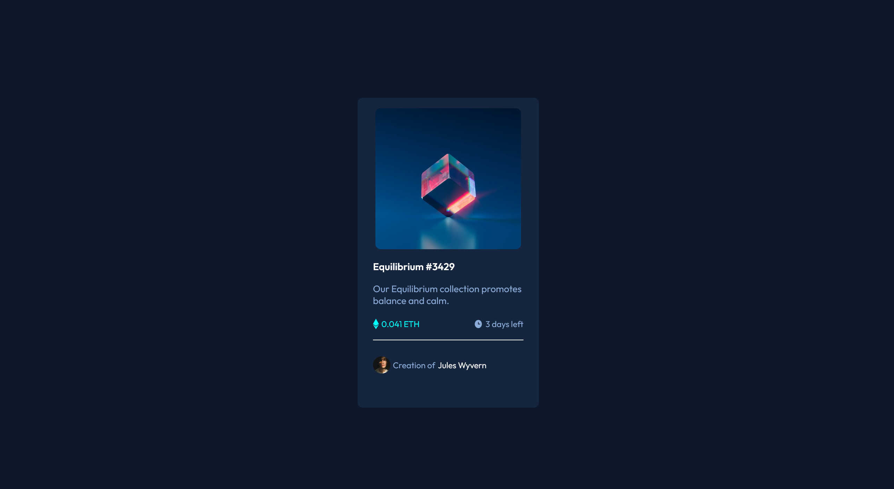

# Frontend Mentor - NFT preview card component solution

This is a solution to the [NFT preview card component challenge on Frontend Mentor](https://www.frontendmentor.io/challenges/nft-preview-card-component-SbdUL_w0U). Frontend Mentor challenges help you improve your coding skills by building realistic projects. 

## Table of contents

- [Overview](#overview)
  - [The challenge](#the-challenge)
  - [Screenshot](#screenshot)
  - [Links](#links)
- [My process](#my-process)
  - [Built with](#built-with)
  - [What I learned](#what-i-learned)
  - [Continued development](#continued-development)
  - [Useful resources](#useful-resources)
- [Author](#author)
- [Show your support](##Showyoursupport)

**Note: Delete this note and update the table of contents based on what sections you keep.**

## Overview

### The challenge

Users should be able to:

- View the optimal layout depending on their device's screen size
- See hover states for interactive elements

### Screenshot

### Links

- Solution URL: [Github Repository](https://github.com/cvalencia1991/NFT-CARD)
- Live Site URL: [Live demo](https://cvalencia1991.github.io/NFT-CARD/)
- live Desing Figma : [Figma desing](https://www.figma.com/file/vSfiWZtVKQDwcerRnhLL2a/Nft-Card?node-id=0%3A1)

## My process

### Built with

- Semantic HTML5 markup
- CSS custom properties
- Flexbox
- CSS Grid
- Mobile-first workflow

### What I learned

I create the blur method for the NFT Card

### Author

👤 **Cesar Alberto Valencia Aguilar**

- GitHub: [https://github.com/cvalencia1991](https://github.com/cvalencia1991)
- Twitter: [https://twitter.com/cvalenciaguilar](@cvalenciaguilar)
- LinkedIn: [https://www.linkedin.com/in/cvalenciaguilar/](www.linkedin.com/in/cvalenciaguilar)

### Show your support

Give a ⭐️ if you like this project!

### 🤝 Contributing

Contributions, issues, and feature requests are welcome!

Feel free to check the [issues page](https://github.com/cvalencia1991/NFT-CARD/issues).

### 📝 License

This project is [MIT](./LICENSE) licensed.
